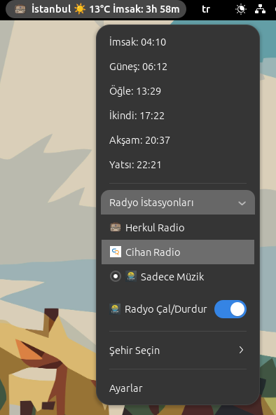
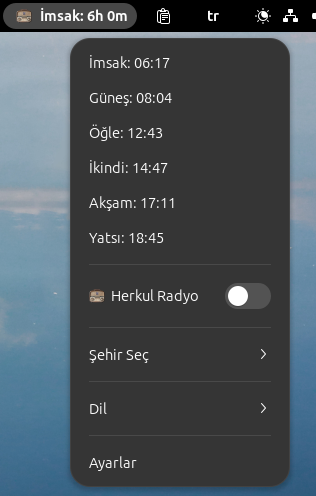
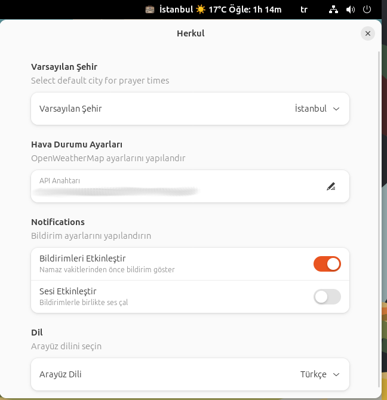

# Herkul GNOME Shell Uzantısı

Herkul, GNOME masaüstü ortamı için geliştirilmiş bir shell uzantısıdır. Bu uzantı, Diyanet İşleri Başkanlığı'nın web sitesinden namaz vakitlerini gösterir, hava durumu bilgisi sunar ve Herkul radyosunu dinleme imkanı sunar.


## Herkul

**Author:** [faymaz](https://github.com/faymaz)









## Özellikler

- 🕌 Diyanet'in web sitesinden güncel namaz vakitleri
- 🌍 Birçok şehir için destek (Türkiye, Almanya, ABD, İngiltere vb.)
- 🌤️ OpenWeatherMap üzerinden güncel hava durumu bilgileri
- 🔔 Namaz vakti yaklaştığında bildirim sistemi
- 🎵 Entegre Herkul Radyo yayını (https://herkul.org/)
- 🎨 GNOME Shell temasıyla uyumlu görünüm
- 🔄 Otomatik güncellenen vakitler
- 🌐 Çoklu dil desteği (Türkçe, İngilizce, Almanca)
- ⚙️ Özelleştirilebilir ayarlar

## Gereksinimler

- GNOME Shell 45, 46 veya 47
- GStreamer (ses çalma özelliği için)
- İnternet bağlantısı
- [OpenWeatherMap](https://home.openweathermap.org) API anahtarı (hava durumu için) sayfasına üye olup [apikey](https://home.openweathermap.org/api_keys) alabilirsiniz.

## Kurulum

### Manuel Kurulum

1. Bu repoyu klonlayın:
```bash
git clone https://github.com/faymaz/herkul.git
```

2. Uzantı klasörüne kopyalayın:
```bash
cp -r herkul ~/.local/share/gnome-shell/extensions/herkul@faymaz.github.com
```

3. GNOME Shell'i yeniden başlatın (X11'de Alt+F2, r, Enter veya oturumu kapatıp açın)

4. GNOME Uzantılar uygulamasından uzantıyı etkinleştirin

### Extensions.gnome.org Üzerinden Kurulum

1. [extensions.gnome.org](https://extensions.gnome.org) adresini ziyaret edin
2. "Herkul" uzantısını arayın
3. Uzantı sayfasındaki düğmeyi kullanarak kurulumu yapın

## Kullanım

Uzantı kurulduktan sonra, GNOME Shell'in üst panelinde bir simge görünecektir. Bu simgeye tıkladığınızda:

- Güncel namaz vakitleri
- Bir sonraki namaz vaktine kalan süre
- Şehir seçim menüsü
- Herkul radyo açma/kapama düğmesi

görüntülenecektir.

### Ayarlar

Uzantı ayarlarına erişmek için:

1. GNOME Uzantılar uygulamasını açın
2. Herkul uzantısının yanındaki ayarlar (⚙️) simgesine tıklayın

Ayarlarda şunları özelleştirebilirsiniz:
- Bildirimler (açık/kapalı)
- Varsayılan şehir seçimi
- Dil seçimi (Türkçe/İngilizce/Almanca)
- OpenWeatherMap API anahtarı

## Desteklenen Şehirler

- 🇹🇷 Türkiye: İstanbul, Ankara
- 🇩🇪 Almanya: Berlin, Stuttgart
- 🇺🇸 ABD: Clifton, Costa Mesa, Irvine
- 🇬🇧 İngiltere: Londra

## Yeni Şehir Ekleme

Yeni şehirler eklemek istiyorsanız, `cities.json` dosyasını düzenleyebilirsiniz:

```json
{
  "cities": [
    { "name": "İstanbul", "url": "https://namazvakitleri.diyanet.gov.tr/tr-TR/9541/prayer-time-for-istanbul", "weatherId": "745044" },
    { "name": "Ankara", "url": "https://namazvakitleri.diyanet.gov.tr/tr-TR/9206/prayer-time-for-ankara", "weatherId": "323786" },
    //
    // Daha fazla şehir ekleyebilirsiniz...
    //
    { "name": "Medine", "url": "https://namazvakitleri.diyanet.gov.tr/tr-TR/16308/medine-icin-namaz-vakti", "weatherId": "109223" },
    { "name": "Mekke", "url": "https://namazvakitleri.diyanet.gov.tr/tr-TR/16309/mekke-icin-namaz-vakti", "weatherId": "104515" }
  ]
}
```

**Not:** Eklediğiniz URL'lerin Diyanet İşleri resmi web sitesindeki doğru sayfalara yönlendirildiğinden emin olun ve weatherId bilgilerinide https://home.openweathermap.org adresinden şehir isimleri bağlantılarından görebilirsiniz. örn. Köln için Cologne, DE sayfasına gidince https://openweathermap.org/city/2886242
{ "name": "Köln", "url": "https://namazvakitleri.diyanet.gov.tr/tr-TR/11019/koln-icin-namaz-vakti", "weatherId": "2886242" },


## Sorun Giderme

1. Vakitler görünmüyorsa:
   - İnternet bağlantınızı kontrol edin
   - Uzantıyı devre dışı bırakıp tekrar etkinleştirin

2. Ses çalışmıyorsa:
   - GStreamer'ın kurulu olduğundan emin olun
   - Sistem ses ayarlarını kontrol edin

3. Hava durumu görünmüyorsa:
   - OpenWeatherMap API anahtarının doğru girildiğinden emin olun
   - İnternet bağlantınızı kontrol edin


## Geliştirme

Projeye katkıda bulunmak istiyorsanız:

1. Bu repoyu fork edin
2. Yeni bir branch oluşturun (`git checkout -b yeni-ozellik`)
3. Değişikliklerinizi commit edin (`git commit -am 'Yeni özellik: XYZ'`)
4. Branch'inizi push edin (`git push origin yeni-ozellik`)
5. Pull Request oluşturun

## İletişim

- GitHub: [@faymaz](https://github.com/faymaz)

